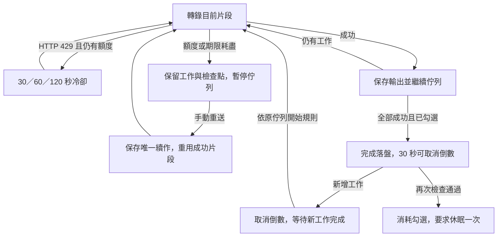

# 雲端冷卻、手動重送與完成後休眠規格

日期：2026-09-21。狀態：**實作與自動化驗收完成；最終 337 XCTest／0 failures，完整 checks 通過。尚未打包安裝，native GUI 與真實休眠／喚醒保留待實機驗收。** 詳見[實作與驗證紀錄](cloud-cooldown-manual-resend-sleep-implementation-2026-09-21.md)，各次暫停歷史見[交班](handoff-2026-09-21-service-recovery-sleep.md)。

原始碼基準：`a6fde8d`（來源 0.2.1 build 7）；已安裝 App 最後核對為 build 6。使用者在安全暫停後要求把實作完成。沿用「App 正在執行，先不要重建」的限制：僅編譯開發 target，未重新打包、安裝、重啟使用者 App，也未發送付費轉錄或真實休眠要求。下文為需求，實測證據及覆蓋界線以實作與驗證紀錄為準。

## 1. 需求與採用的假設

使用者已明確要求：

1. 雲端忙碌時冷卻更久。
2. 新增清楚的手動再送功能。
3. 所有轉檔跑完後可讓電腦休眠；**預設關閉，需要時勾選**。

以下秒數、按鈕文案與完成條件是本規劃的建議值，不代表使用者逐項指定。

已詢問「有失敗或暫停時是否仍休眠」，截至草案尚未收到回覆。暫採：**本次工作全部成功且輸出保存完成才由 App 要求休眠；失敗、缺口或等待手動處理會阻止自動休眠**。這不表示 App 在暫停後永久阻止 macOS 原有的閒置休眠。若使用者選擇「處理停止後就休眠」，應改寫第 5 節及相應測試，不可混用兩種完成定義。

## 2. 現況與問題

| 已確認現況 | 本次要改善的結果 |
| --- | --- |
| 一筆首段四次 HTTP 429，沒有成功片段 | 冷卻後有限重試；用完額度仍保留原設定，提供手動重新送出 |
| 另一筆前三段成功，第 4 段三次網路失敗後收到 429 | 顯示完整混合失敗歷程；手動續作重用前三段，只處理剩餘片段 |
| `GeminiGenerationRetry` 與 transport 共用每片段／模型最多四次 generation 發送 | 保留總上限，避免把網路與 HTTP 重試相乘 |
| 429 使用約 1–1.5、2–3、4–6 秒退避 | 改為較長的服務冷卻，顯示下次嘗試倒數 |
| 網路暫停已有 journal、queue gate、續作去重及 crash window 處理 | 服務忙碌復用這些保障，保持服務與網路原因分開 |
| 一般「重試」會從頭新建；檢查點續跑是另一個入口 | 主要動作統一依有效檢查點選擇「重送未完成片段」或「重新送出」 |
| engine 執行期間已有 `SleepPreventionService` | 休眠由 App 的完整佇列與保存狀態判定，不能只檢查目前是否有 request |

Google 的一般 `Resource exhausted` 訊息不足以區分共享容量與特定專案限制，也無法定位先前網路故障的環節。較長冷卻是產品策略，不保證 Google 在指定時間恢復。官方建議採有上限的指數退避。[Google 429 說明](https://cloud.google.com/vertex-ai/generative-ai/docs/error-code-429)

## 3. HTTP 429：較長冷卻與服務暫停

### 3.1 等待政策

| 項目 | 規劃值 |
| --- | --- |
| 第一次失敗後、準備第 2 次發送 | 30 秒，加 0–20% 正向 jitter |
| 第二次失敗後、準備第 3 次發送 | 60 秒，加 0–20% 正向 jitter |
| 第三次失敗後、準備第 4 次發送 | 120 秒，加 0–20% 正向 jitter |
| 伺服器指定等待 | 取上述等待與有效 `Retry-After`／`google.rpc.RetryInfo` 的較大值 |
| generation 上限 | 每待處理片段／模型最多 4 次實際 task 發送；含網路、401、POSIX 重送 |
| 根片段期限 | 沿用 900 秒，包含冷卻、網路等待、前處理、上傳與生成 |
| 網路等待 | 保留既有 300 秒額度及 15／45／120 秒策略；429 冷卻不冒充網路等待 |

冷卻索引使用同一發送額度已用次數，而非另外建立一份可重設的「429 四次」。例如先兩次網路失敗、第 3 次收到 429，下一次最多只剩第 4 次，採第三級服務冷卻；先三次網路失敗、第 4 次收到 429，直接進入待手動重送。

第一版以 Vertex／AI Studio 的轉錄生成為核心；兩後端經共用 transport 的上傳初始化、上傳與 metadata GET 所收到的 429 也採同一冷卻政策，但仍使用各自既有的最多四次額度。健康的 Files `PROCESSING` 輪詢維持原間隔，不算 429 重試。GCS／Files 與 generation 不互相重設額度。

每個等待先檢查根片段及目前階段剩餘期限；poll 保留有效輪詢期限。剩餘時間不足時保留工作為服務暫停，記錄期限原因，不能縮短伺服器要求的等待後硬送。等待時不占用已開始的 HTTP task，使用可取消的非同步計時；取消需在一秒內解除等待。

`Retry-After` 補齊秒數與 HTTP-date 解析，與有效 `RetryInfo` 同時存在時採較晚期限；無效或非有限數值不得造成零延遲迴圈。以注入時間處理測試，運行中的倒數採 monotonic clock；保存絕對 `serverNotBefore` 供重啟與手動續作沿用。[RFC 9110 §10.2.3](https://www.rfc-editor.org/rfc/rfc9110.html#section-10.2.3)

429 專屬的新政策不改變 STOP 空內容、一般 5xx、認證失敗的既有分類及重試規則。已確認日額度耗盡者不做短週期自動重試，提示檢查配額，仍可由使用者稍後手動再送。任何成功或失敗都保留原 HTTP status 與 stage。

### 3.2 冷卻與暫停呈現

| 狀態 | 顯示與佇列行為 |
| --- | --- |
| coolingDown | 「Google 暫時忙碌，約 60 秒後進行第 3／4 次嘗試；已完成 3／5 段」。維持原片段進度，暫不處理下一工作 |
| retrying | 「正在重送第 4／5 段」；同一時間只有一個執行 request |
| paused | 「Google 仍忙碌，已保留工作，請稍後手動重送」。保留 checkpoint／原始快照，後續佇列停住 |
| resolved | 繼續目前片段與原佇列，保留歷史診斷 |

用完次數、下一次冷卻超出階段／根期限、明確日額度耗盡，均保存停止原因後進入服務暫停。純非429失敗仍走原本分支。若使用者既有設定已允許特定模型 fallback，先依該設定及同一根期限處理，全部適用的有限策略結束後才建立 paused gate；不能暗中啟用 fallback。

暫停以 `.interrupted` 配合新增 optional `serviceRecovery` 保存，不新增「成功」假狀態，不把 429 塞入 `networkRecovery`。至少保存 reason、stage、stopReason、attempts、累計冷卻、serverNotBefore、目前片段、完成片段數及結果是否可能未知。

App 重啟後，曾在冷卻／重試中退出的工作恢復為待手動續作，不自動發送；unknown enum 同樣正規化為可操作暫停。暫停工作不受最近歷史筆數裁切。零成功片段仍保存原工作與暫停資訊，不偽造可重用 checkpoint。

第一版沿用單工整體 queue gate：有未解除的網路或服務暫停，後續工作都留在佇列。取消暫停工作可解除對應 gate，但不自行開始後續付費工作。

## 4. 手動再送

### 4.1 使用者動作

| 工作情況 | 主要按鈕與行為 |
| --- | --- |
| 有有效已完成片段 | **重送未完成片段**：驗證 checkpoint，沿用成功片段，從第一個未完成片段繼續至整份完成 |
| 沒有完成片段 | **重新送出**：沿用原工作快照，從第 1 段重新嘗試 |
| 已有續作排隊／執行 | 顯示「已排入重送」／「正在重送」，不可再建立另一份 |
| 正在自動冷卻或 request 執行中 | 顯示倒數／進度與「取消」；手動重送不另外平行發送或繞過等待 |
| 暫停後仍有伺服器等待下限 | 按鈕可建立唯一續作，但顯示「等待 Google 指定時間」，到期才發送 |
| 檢查點損壞或來源不存在 | 明確顯示原因；不靜默從頭轉整份，不覆蓋原救援檔 |

按鈕適用於新服務／網路暫停，以及仍保有原快照與來源的既有雲端失敗工作，不以比對中文錯誤訊息判定。build 6 的零完成及多片段失敗均需可操作。只有最近摘要、沒有完整原快照的舊紀錄，保留既有「依目前設定重新建立」行為並標明差異。

主要手動再送沿用原後端、模型、prompt、詞庫、分段和輸出設定；憑證在執行時取得，不寫入快照。另有「依目前設定重新建立」才視為完整新工作，兩者文案必須清楚。

### 4.2 續作一致性

1. 檢查來源、checkpoint 與原快照，建立唯一 continuation ID，父子關聯及父狀態同一份 journal 原子保存。
2. 保存成功後才准許付費 request；保存失敗保留 gate，重按仍用同一 continuation ID。
3. 手動動作是新一輪有限嘗試，為未完成根片段建立新 900 秒與四次發送額度；保留歷史事件及伺服器等待下限，不會因 UI 重繪或背景 timer 自行重設。
4. 已完成片段不再上傳或生成；若傳輸失敗使先前結果未知，提示「先前請求結果未知，重送未完成片段可能再次計費」。
5. 續作優先於尚未開始的普通工作；已有工作正在執行時不搶占，排為下一筆。paused gate 只准許它所對應的續作通過。
6. 雙擊、同時從不同入口操作、保存後啟動前 crash、退出時 flush 完成，都不產生第二個續作或退出後付費 request。
7. 同一父工作的一輪續作完成前保持唯一；續作再次暫停後，下一次使用者操作接到最新未完成節點。舊父工作仍保留歷史，但不重複阻塞已成功的續作。

## 5. 全部轉檔完成後休眠

### 5.1 開關與本次工作範圍

主畫面佇列／開始按鈕附近加入 checkbox：**「本次全部轉檔成功後讓電腦休眠」**，說明「僅本次有效；有失敗、缺口或暫停時不會自動休眠」。第一版不放在隱藏的進階設定中。

- 預設關，App 每次啟動為關；不把 `true` 保存為長期設定。休眠要求送出、取消倒數、退出或本次作業被取消後，重設為關。
- 可在開始前或執行中勾選。只有空佇列／舊歷史時勾選，不立即倒數；等待本次至少有一筆工作開始。
- 本次範圍包含勾選時正在執行／排隊的工作及本次結束前新增的工作；歷史失敗不阻擋新批次。
- 手動重送是原邏輯工作的續作；以最後有效續作結果判定，避免已成功後仍被舊父工作的 failed／interrupted 擋住。
- 須有獨立的本次工作清單／完成憑據，不能只掃描會被 `recentJobLimit` 裁切的畫面陣列；歷史顯示上限為 0 仍須正確。
- 新增檔案仍保留目前「按開始才處理」規則；等待使用者開始的新 queued 工作會阻止休眠。
- 取消或刪除本次待處理工作會取消本次自動休眠勾選，不得藉由工作消失推導成全部成功。使用者可為接下來的工作重新勾選。

### 5.2 休眠資格

必須同時符合以下條件才開始 30 秒倒數：

1. 使用者仍勾選、本次至少啟動過一筆工作，且不是 App 結束流程。
2. 本次所有邏輯工作都已完成、`outputCompleteness == complete`；`hasGaps` 或未知完整性不當作已驗證成功。
3. 沒有 active、queued、下載／轉換／生成／寫檔、冷卻、自動重試、等待手動續作、等待憑證／環境／詞庫同意，或續作保存中。
4. 所有正式輸出發布與工作 journal 都已成功落盤，無待保存修訂或保存錯誤。
5. engine 的 request、helper 工作與收尾已結束；完成後通知／開啟輸出等既有動作已交接。App 內另有檔案合併等處理或待確認的匯入流程時暫緩。

`.isTerminal` 包含失敗、取消、interrupted，**不能直接拿來當休眠資格**；`activeJobID == nil`、`hasQueuedJobs == false` 或雲端 request 結束也都不足以觸發休眠。

### 5.3 倒數與系統整合

- 顯示「本次轉檔已全部成功，30 秒後讓電腦休眠」及「取消休眠」。無須使用者在倒數結束時再確認。
- 倒數期間新增工作、開始手動續作、出現保存錯誤或其他不合條件狀態，立即停止倒數；新工作加入本次範圍，後續全部成功才重新完整倒數。
- 使用者取消倒數或取消勾選，解除本次休眠，不會下一次狀態更新又倒數。
- 倒數結束後等待最新 journal revision 保存，再檢查本次 generation token、所有工作狀態及勾選。檢查與系統請求間不留可讓新工作插入的非同步窗口。
- 全程保持必要的「正在工作」防閒置休眠活動到收尾；要求系統休眠前釋放 App 的活動 token。暫停待人處理時釋放工作防休眠活動，維持 macOS 原有政策。
- 一次勾選最多發送一次系統休眠要求，發送前即消耗該勾選；喚醒後不重複休眠。
- 使用獨立可注入 `SystemSleepService`，首選公開 IOKit `IOPMSleepSystem`，檢查回傳碼及關閉連線。官方要求呼叫者為 root 或 console user；App 不要求提權、不修改系統能源設定。實際支援性納入 bundle／GUI 驗收。[Apple IOPMSleepSystem](https://developer.apple.com/documentation/iokit/1557121-iopmsleepsystem)
- 系統拒絕時顯示「轉檔已完成，但無法讓電腦休眠」，留下去識別化錯誤碼並取消勾選，不循環重試。已成功的轉錄仍是成功。
- 日誌區分「已送出休眠要求」與接獲系統 sleep 通知；API 接受要求不等於已證明整機睡著。
- 此功能由 App 狀態驅動；不建立 LaunchAgent、每日排程或外部 ledger 輪詢。既有 2026-09-21 一次性排程已停用，不重新啟用。

簡化流程：

## 6. 程式分工與實作順序

避免繼續把所有邏輯加進 `AppViewModel` 或讓兩個 backend 再次複製規則。

| 階段 | 主要檔案／元件 | 完成條件 |
| --- | --- | --- |
| P1：冷卻與錯誤傳遞 | 新增 `CloudServiceRecoveryPolicy`／context；修改 `GeminiGenerationRetry`、`GeminiTransportHelper`、兩 backend 的型別錯誤、`CloudSegmentBudget`／polling 計時整合及 diagnostic | 兩後端使用同一429政策，HTTP-date與混合錯誤不增加額度；停止原因可穿透 engine |
| P2：暫停與手動重送 | `Models`／`PipelineExecutionError` 加 optional serviceRecovery；抽共用續作協調元件供既有 network resume 與新 service resume 使用；`AppViewModel` 保留薄入口 | 零／多完成片段、去重、原子保存、queue gate、重啟都可用 |
| P3：完成後休眠 | 新增 `QueueCompletionSleepCoordinator` 與 `SystemSleepService`；接入 MainView、queue drain／落盤／取消／匯入與退出事件 | 預設關、精確完成判定、30秒倒數、只要求一次、工作與保存競爭有保護 |
| P4：整合驗收 | synthetic audio、mock transport／sleep service、既有回歸與 native GUI | 測試通過後再安排打包安裝；不在仍有工作時替換 App |

序列化採 additive optional 欄位與 unknown fallback，保留舊 `networkRecovery`／`networkContinuationJobID` 的讀取相容；共用 coordinator 透過 adapter 操作兩類欄位，不趁此做全模型命名遷移。服務暫停與網路暫停有統一的 queue gate 判定，但診斷與等待額度分開。

本次範圍不含雲端持久化 job／Batch API、任意增加模型發送次數、改動轉錄內容或預設模型、自動繞過配額、每天定時休眠。上限與 checkpoint 契約仍以既有[網路恢復規格](network-recovery-spec-2026-09-19.md)為基礎，本文件只新增服務冷卻／重送入口／休眠行為。

## 7. 驗收清單

所有冷卻計時用可注入時鐘，所有休眠自動測試用 fake service；測試不得真的休眠開發機。下列 C01–C07、R01–R05、S01–S07 的自動化證據與限制已整理於[驗證對照](cloud-cooldown-manual-resend-sleep-implementation-2026-09-21.md#自動化驗收對照)；S08 實機項目尚未執行。

| ID | 案例 | 必須結果 |
| --- | --- | --- |
| C01 | 兩backend各自429→429→成功 | 依30／60秒最低間隔與jitter；只三次generation |
| C02 | 四次429 | 第四次後服務暫停，無第五次，後續queued不送 |
| C03 | 三次network→一次429；兩次network→429→成功 | 四次共用額度，保留每次分類；服務等待不重設network額度 |
| C04 | Retry-After秒數／HTTP-date、RetryInfo、無效值、過長等待 | 遵守較晚下限；無效值不忙迴圈；超過root期限則暫停 |
| C05 | upload／metadata／poll 429及正常PROCESSING | 階段quota與poll/root期限不變；正常poll不套30秒失敗冷卻 |
| C06 | 冷卻時取消、退出；冷卻期間root timer先到 | 取消一秒內停止，退出不發送；terminal診斷保留429與deadline |
| C07 | 日額度、401／403、5xx、STOP空內容、允許／未允許fallback | 不把其他原因顯示為429；fallback不擅自啟用且不重設root期限 |
| R01 | 零完成片段、新暫停／build6舊failed | 能建立唯一手動續作，沿用快照而非目前選單 |
| R02 | 完成三段、第四段失敗 | 三份checkpoint bytes不變，只發未完成片段，後續片段正常處理 |
| R03 | 雙擊、多入口、續作保存失敗、保存後crash／退出 | 只有一份續作，未落盤或退出不得開始付費request |
| R04 | 損壞checkpoint、來源遺失、過期URI、原工作結果未知 | 明確提示或沿用既有有限重建；不靜默整份重做；保留結果未知提醒 |
| R05 | 重啟、recent limit=0、unknown recovery state、舊ledger | 可讀、可操作、gate不丟失；不自動重送 |
| S01 | 預設關／重新啟動／已完成空佇列才勾選 | 無休眠要求；空佇列不立即倒數 |
| S02 | 本機／AI Studio／Vertex混合佇列全部完整成功 | 最後輸出與journal落盤後才倒數；fake sleep恰好一次 |
| S03 | 冷卻、網路暫停、服務暫停、失敗、含缺口、等環境／憑證／人操作 | 不觸發自動休眠，不把queue task結束當全部成功 |
| S04 | 倒數時加檔、重送、取消勾選、取消／刪除工作 | 倒數取消；新增工作後等待完整處理，取消操作消耗勾選 |
| S05 | 已失敗父工作續作成功；歷史失敗／recent limit=0 | 用本次邏輯工作最終結果；歷史與裁切不造成誤判 |
| S06 | TXT發布／journal失敗或延遲、最後一次檢查時新增工作 | 無未保存即休眠；無stale callback要求休眠 |
| S07 | 系統拒絕、正常睡眠後醒來、App退出／crash | 拒絕可見，不重試迴圈；喚醒／重啟開關關閉 |
| S08 | native GUI與系統電源事件 | checkbox、倒數取消、實際sleep/wake正確；人工驗收才執行一次真休眠 |

已通過有針對性的測試、`SKIP_APP_BUNDLE=1 REQUIRE_XCTEST=1 scripts/run-checks.sh` 與 `git diff --check`。真實休眠安排在使用者無執行中工作且可接受整機休眠時；不得以 mock 成功宣稱已實機驗收。
